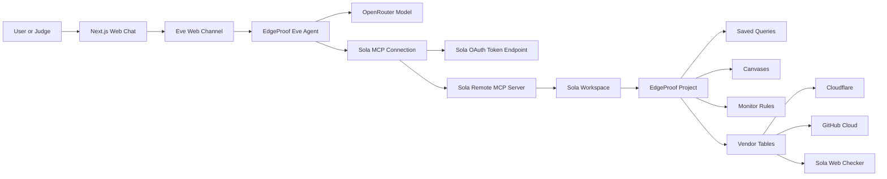

# EdgeProof Architecture

EdgeProof is a thin Eve agent over Sola MCP. The Sola workspace remains the source of truth for security evidence; the agent turns that evidence into domain-first breach path summaries for the hackathon demo.

## System Diagram

## Data Flow

1. The user asks EdgeProof for code-to-edge breach paths.
2. Eve routes the chat request to the EdgeProof agent.
3. The agent uses OpenRouter for reasoning and Sola MCP for workspace evidence.
4. The Sola connection exchanges `SOLA_CLIENT_ID` and `SOLA_SECURITY_KEY` server-side for a token.
5. Sola MCP exposes read-only tools such as `list_apps`, `get_app_details`, `get_app_queries_tool`, `get_vendor_tables`, `get_vendor_schemas`, `execute_sql`, and `explore_data`.
6. EdgeProof inspects the Sola project, vendors, saved queries, and table schemas before attempting SQL or natural language exploration.
7. The final answer is a short set of breach path packets, each anchored to a public domain or edge asset.

## Security Model

- Sola MCP access is read-only.
- Sola credentials are server-side environment variables.
- No Sola secret, OpenRouter key, bearer token, Vercel token, or local `.env` file is committed.
- Browser clients never receive `SOLA_SECURITY_KEY` or `OPENROUTER_API_KEY`.
- Public demo auth is isolated in `agent/channels/eve.ts` and is suitable for the hackathon preview only. Replace it with a real auth provider before using EdgeProof with sensitive production data.

## Evidence Strategy

EdgeProof prioritizes evidence in this order:

1. Sola project metadata and integration status
2. saved EdgeProof query names and descriptions
3. Cloudflare, GitHub Cloud, and Sola Web Checker tables
4. schemas for exact column-safe SQL
5. read-only SQL results
6. Sola graph intelligence from `explore_data`

If Sola credits are exhausted, EdgeProof does not fake results. It reports the credit limit and still summarizes what it can prove from tool discovery, metadata, saved queries, monitors, and integration state.

## Breach Path Packet Shape

Each finding should include:

- public domain or edge asset
- exposure evidence from Cloudflare, Workers, or Web Checker
- linked or inferred GitHub repository
- weak control such as missing branch protection, risky workflow, broad admin access, or missing vulnerability scanning
- attack path narrative
- severity
- remediation
- Sola evidence source

## Severity Logic

- **Critical:** public edge asset plus a weak GitHub control that can affect deployment, release, workflow execution, branch protection, or admin access.
- **High:** public or sensitive domain exposure where repo linkage is inferred or controls are partially protected.
- **Medium:** domain exposure exists but no controlling repo or deployment path is confirmed.
- **Low:** generic GitHub hygiene without a domain anchor.
